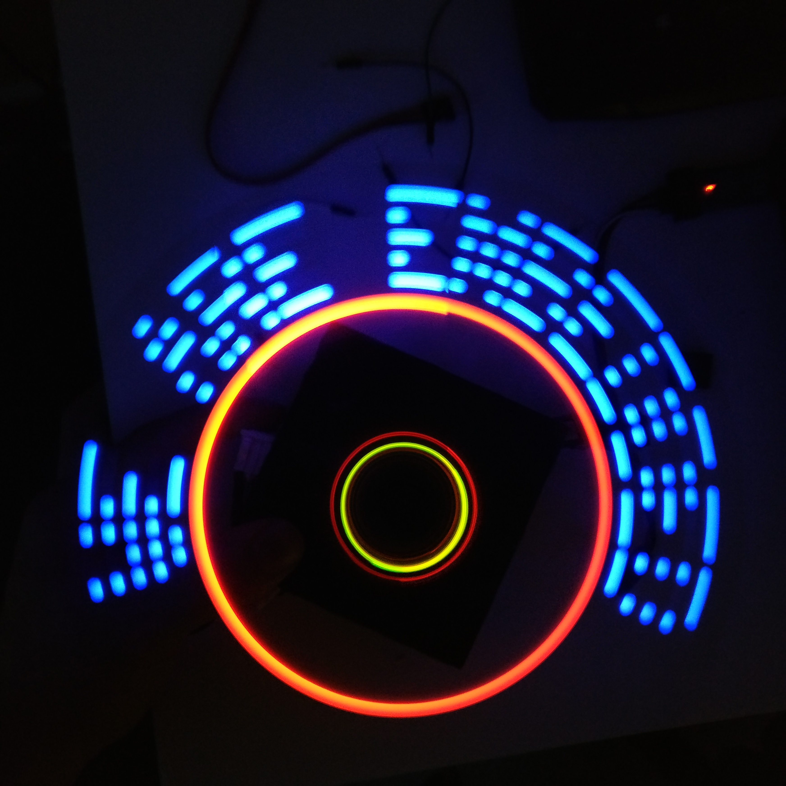

# RUST - Are We Embedded Yet
An in-depth course in embedded system given at Luleå university of technology.

## Project - Printing device

### Description
The project consists of making a "printing device". The device consists of a motor, a stick with LEDs mounted at the end of the stick, a hall sensor, magnets, a battery and a STM32 microcontroller. The device prints human readable text by turning LEDs on and off with precise timings. The code is written in Rust.  
  
The desired width of the characters is pre-defined and can be changed, the device does thus take into account the current angular velocity to keep the text at constant width.  
  
The stick on which the components are mounted to is contructed in FreeCad and 3D-printed with an Ultimaker 2. 

The LEDs, resistors and the hall sensor are glued to the stick and wired according to the schematic below.

The motor is mounted to a plastic case and connected by a switch to an AC/DC converter so that it can be powered from the grid. Finally the magnet is mounted so that the hall sensor can detect it. 

